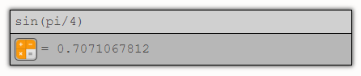
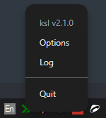

<div style="text-align: center;">
  
</div>

# ksl
Keystroke launcher for developers who loves JS

This app is simply keystroke for launch applications, scripts, open files and etc. It designed for developers, who can tune app via simple json file (like in Sublime Text), who can write own scripts or plugins in JS

After run app, you will see tray icon, when you can find options and file.
To run keystroke, you can use hotkey Ctrl + Alt + P by default, or run it from tray.

<div style="text-align: center;">
  
</div>

Options file has a intuitive settings.

```json
{
	"runHotkey": "Ctrl + Alt + P",
	"startOnSystemStart": false,
	"plugins": [
		{
			"directory": "C:/Users/LIS355/AppData/Local/ksl/plugins/ksl-plugin-emailcopytoclipboard"
		},
		{
			"directory": "C:/Users/LIS355/AppData/Local/ksl/plugins/ksl-plugin-keepass"
		}
	]
}

```

## Plugins

You can write your own plugins/scripts in JS and pass it to launcher, assign hotkey

Every plugin - is JS packet, and you can you all JS power what you need.

To use plugin add plugin options object to options file like this

```json
"plugins": [
	{
		"directory": "C:/Users/LIS355/AppData/Local/ksl/plugins/ksl-plugin-emailcopytoclipboard"
	}
]
```

In your plugin directory you need to have these files

`package.json`

```json
{
	"name": "ksl-plugin-emailcopytoclipboard",
	"type": "module",
	"main": "index.js"
}
```

And main script file (which was in `package.json`)

`index.js`

```json
{
	"name": "ksl-plugin-emailcopytoclipboard",
	"type": "module",
	"main": "index.js"
}
```

`index.js` must default export class with these methods:

* `async load(pluginsManager)` executes when plugin is loading, pass pluginsManager
* `async unload()` executes when plugin is unloading (when options is changing or application will exit)
* `query(query, queryOptionsReceiver)` executes when user input some string, plugin may suggest option: it contains title, description, icon
* `execute(queryOption)` do some action on selected queryOption

Example: this is a plugin for copy my email adress to clipboard, when i input string "email", launcher suggest to me option with action to copy my email to clipboard

```javascript
const EMAILS = [
	"lartsov@gmail.com"
]

export default class KslPluginEmailCopyToClipboard {
	async load(pluginsManager) {
		this.pluginsManager = pluginsManager;
	}

	async unload() { }

	query(query, queryOptionsReceiver) {
		const queryTextLower = query.text.toLowerCase();
		if (queryTextLower.startsWith("email")) {
			EMAILS.forEach(email => {
				queryOptionsReceiver(this, {
					query,
					text: email,
					meta: {
						description: "copy to clipboard"
					}
				});
			});
		}
	}

	execute(queryOption) {
		this.pluginsManager.electron.clipboard.writeText(queryOption.text);
	}
};
```

When user print "email" string, plugin suggest option with email title (text property), description, icon

Then, if user execute this queryOption, we need to copy to clipboard it's text

We can use `pluginsManager.electron` to get acess to electron stuff

You can use any of `npm` modules as you want, your plugin - it is usial npm package
